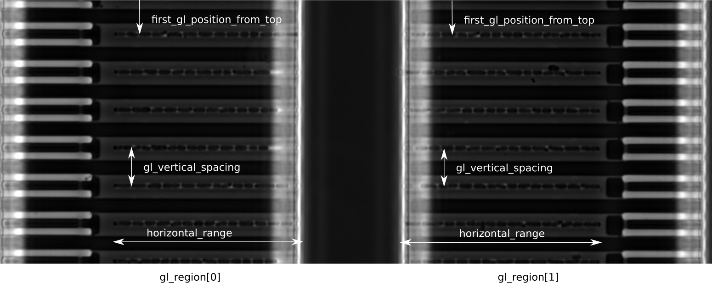

# mmpreprocessingpy documentation

## GL detection template

### Template definition

`mmpreprocessingpy` can use a template-image to do template-matching in order to
detect growthlanes in the mother-machine image. The template-matching operation is done once on the first frame of each position that will be processed.

Here we describe, how to generate an adequate template-image and setup up a corresponding config-file.

This is an example template config-file, which I generated for/from the dataset `16_thomas_20201229_glc_lac_1_MMStack.ome.tiff` (stored in e.g. `example_template_config.json`):

```json
{
  "name": "template__thomas_20201229_glc_lac_1",
  "description": "",
  "template_image_path": "./16_thomas_20201229_glc_lac_1_MMStack.ome-1___template_v01_2.tif",
  "pixel_size_micron": 0.065,
  "gl_regions": [
    {
      "first_gl_position_from_top": 3.38,
      "gl_spacing_vertical": 6.87375,
      "horizontal_range": [
        1.95,
        36.725
      ]
    },
    {
      "first_gl_position_from_top": 3.38,
      "gl_spacing_vertical": 6.87375,
      "horizontal_range": [
        54.6,
        91.65
      ]
    }
  ],
}
```

Explanation of the parameters:



* `name` and `description`: These are for documentation purposes of the user (they are not relevant for functionality and could be left empty).
* `template_image_path`: Defines the path to the template image. This path can be relative or absolute (I suggest making this path relative (as shown here) and storing the template image next to the corresponding config-file).
* `pixel_size_micron`: The parameters `horizontal_range`, `gl_spacing_vertical` and `fist_gl_position_from_top` are expected to be in microns. This value is needed by the program to convert into pixels positions.
* `gl_regions`: Here we define regions in the template-image that contain growth lanes. We can define multiple regions (e.g. for two-sided MMs). For each region we must specify the parameters:
  * `horizontal_range`: We assume the GLs to be oriented horizontally in the image. This defines the range, where the GLs are located (in microns; starting from the left side). You should specify a slightly larger range than the actual GL-length, if you desire margins before and after the GL in the output ROI-images in $\mu$m.
  * `gl_spacing_vertical`: Vertical distance between the centers of two adjacent GLs in  $\mu$m.
  * `fist_gl_position_from_top`: The position fo the first GL as seen from the top of the image in $\mu$m.

Each entry in `gl_regions` must define its own values for `horizontal_range`, `gl_spacing_vertical` and `fist_gl_position_from_top` even if they are identical.

Note:
* You can use ImageJ to quickly create template-image crop and read the positions in $\mu$m from that crop.

### Creation of template image

Things to consider for creating a GL template image:
* To create a template-image you can crop a region from any position of your experimental data. It should be as large as possible, but not be unique to the respective position (i.e. do *not* include any unique things such e.g. position-numbers).
* Make sure that the source-image is rotated so that the GLs are oriented horizontally in the image before making the crop. In ImageJ select `Image -> Transformation -> Rotate ...` to do so.
* From my testing, all GLs in the image should ideally be completely filled with cells. This suspect that this aids the template-matching, because full/dark GLs will contribute less in the calculation of the cross-correlation value than empty/bright GLs. This is preferable, since the appearance of GLs in the position-image will be different from position to position.

### Template usage

To use a GL detection template we set the parameter `GL_DETECTION_TEMPLATE_PATH` to point to the template configuration file inside the SLURM script:

```
GL_DETECTION_TEMPLATE_PATH="/path/to/example_template_config.json"
```

Note:
* Without this parameter `mmpreprocessingpy` will still run and instead use a method of detecting GLs that does not require a template configuration.
